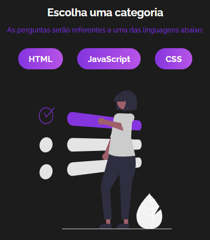

# _Quiz - Aplicação Web de Perguntas e Respostas_[:link: :point_left:](https://programmingquizz.netlify.app/)

## Caracteristicas da aplicação:

- Tela de introdução, para iniciar o quiz.
- Tela de seleção de categoria das questões.
- Tela da questão e as alternativas em formato de card, com funcionalidades de ajuda.
- Tela de Fim de jogo, com a pontuação final e a opção de reiniciar o quiz.

### Introdução

### Selecão de Categoria

### Questão

### Fim de Jogo

### Tecnologias Usadas:

